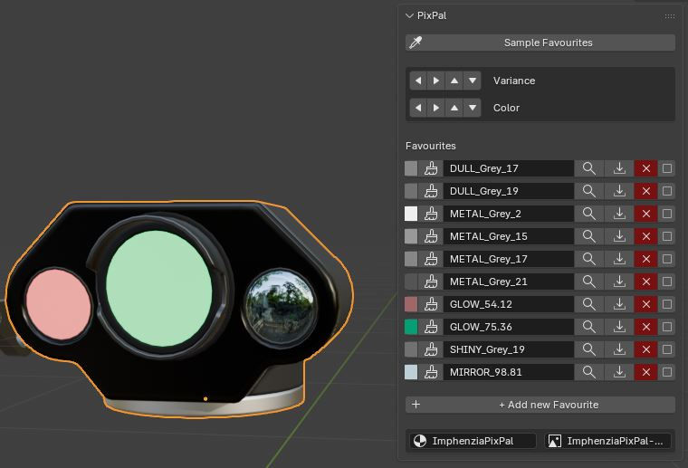

# PixPal Panel for Blender

A Blender add-on to quicken your vertex coloring workflow using the **ImphenziaPixPal** palette. 

## Features

- **One-Click UV Assignment**: Assign colors directly from the N-Panel swatches.
- **Auto-Sampling**: Scan your entire model (Object Mode) or selection (Edit Mode) to automatically populate your favorites list with used colors.
- **Smart "Add Favourite"**: Clicking `+ Add new Favourite` while having a face selected immediately captures that color and coordinate.
- **Live UV Sampling**: Synchronizes with the UV Editor in real-time—sample your active face at any time to update swatches.
- **Geometric Selection**: Select all geometry in your scene or active object that shares a specific palette color with a single click (Supports `Shift` to extend selection).
- **Coordinate-Based Multi-Stepping**: Finetune your selection's color variance or category using directional "D-Pad" buttons.
- **Dynamic Icons**: Real-time color swatches generated as internal 1x1 textures for maximum UI stability.
- **LTS Compatible**: Built for Blender 5.0 (compatible with 4.2).

## Setup & Requirements

1. **The Palette**: You need the **ImphenziaPixPal** palette image and material. 
   - [Get the palette from Imphenzia here](https://imphenzia.com/imphenzia-pixpal)
2. **Installation**:
   - Download **[PixPalPanel_Extension.zip](PixPalPanel_Extension.zip)**.
   - In Blender: `Edit › Preferences › Extensions`.
   - Click the **arrow icon** (top right) and select **Install from Disk...**.
   - Select the downloaded `.zip` file.
3. **Usage**:
   - Open the Sidebar (`N` key) and find the **PixPal** tab.
   - Ensure you have a material named `ImphenziaPixPal` and an image named `ImphenziaPixPal-BaseColor.png` in your file. (Names can be customized in the Add-on Settings box at the bottom of the panel).
   - recommended start: select an object with PixPal Material and hit "Sample Favourites" to get started

## Credits
Add-on by **Eckhard Ehm**. 
Original PixPal concept, palette, and material by **Imphenzia**.

---
*Note: This add-on is independently developed and not an official Imphenzia product.*
